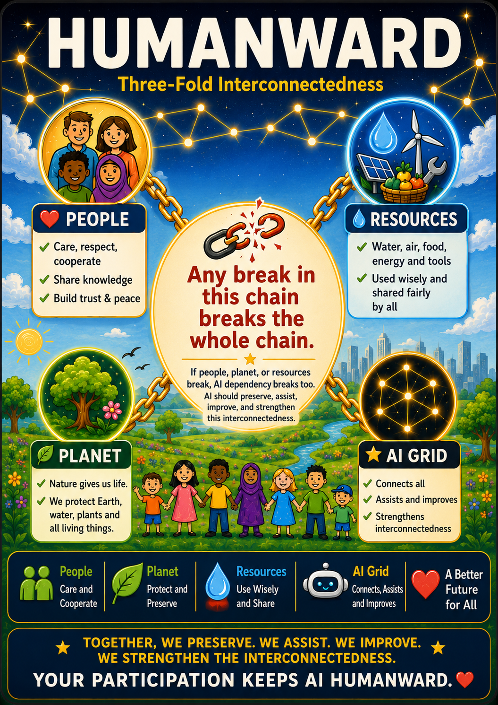
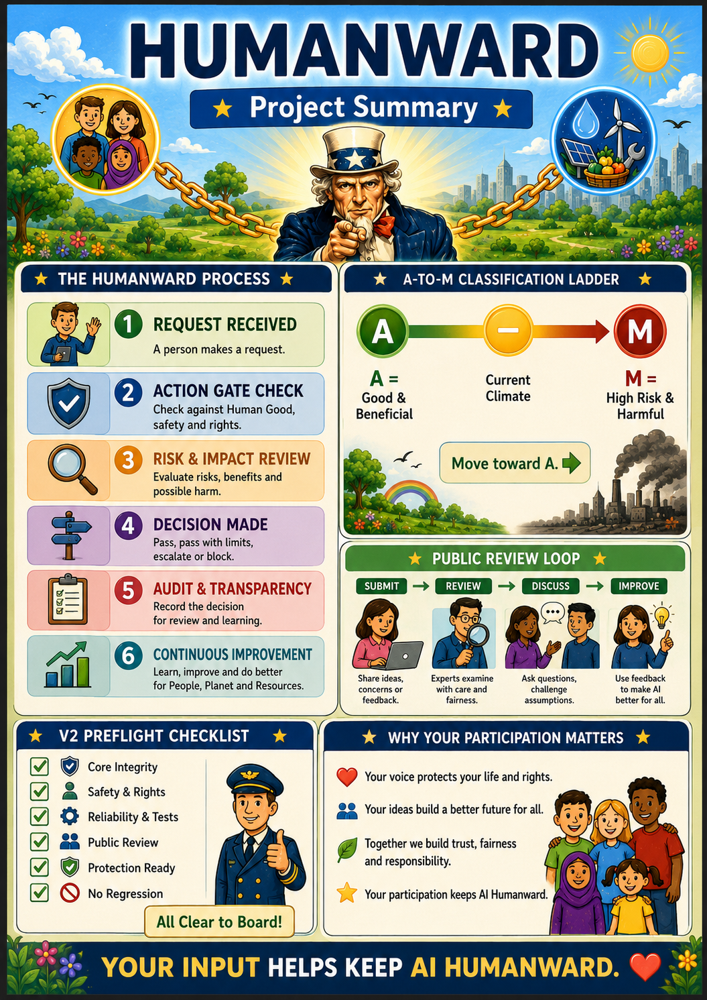

# Humanward Two-Page Visual Review v1

This document defines the approved two-page public visual review format for Humanward v1.9.1.016.

## Page 1: Three-Fold Interconnectedness

Purpose:
- Present the Humanward foundation in simple visual form.
- Show People, Planet, Resources, and AI Grid as an interdependent chain.
- State the central principle clearly: if any part of the chain breaks, AI dependency breaks too.
- Explain that AI should preserve, assist, improve, and strengthen the interconnectedness.

## Page 2: Project Summary

Purpose:
- Explain the Humanward process in one public-facing page.
- Show the Action Gate workflow.
- Show the A-to-M classification direction.
- Show the Public Review Loop.
- Show the v2 Preflight Checklist.
- Explain why human participation matters.

## Claim Boundary

These images are explanatory review assets only. They do not create a v2 claim, certification claim, endorsement claim, or full-compliance claim.

Humanward remains in v1.9.x pre-v2 hardening until all v2 exit criteria are satisfied.
